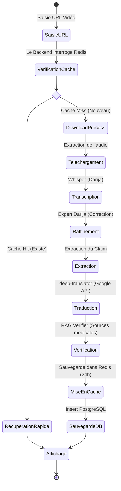
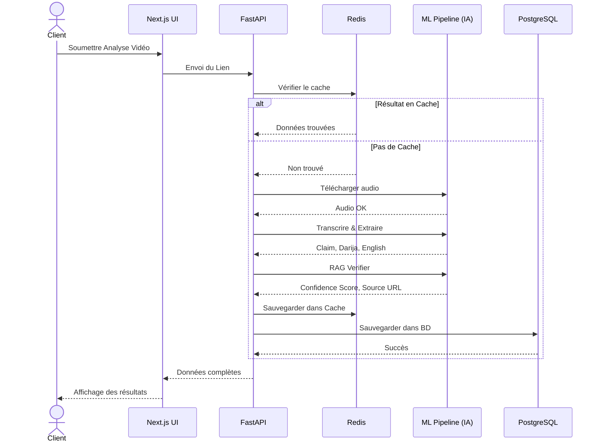
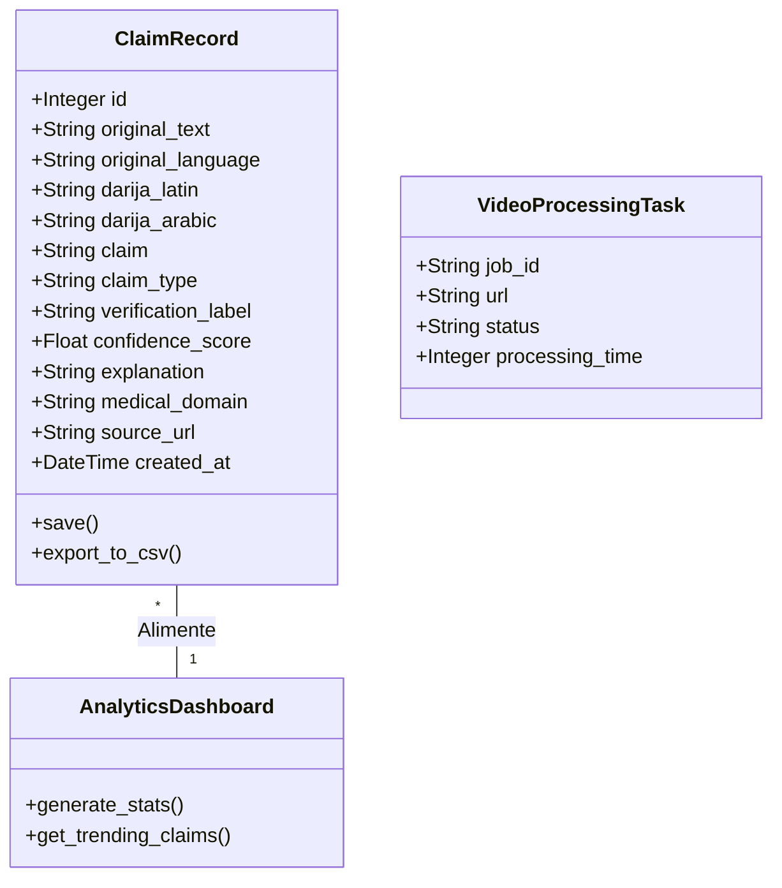

# Rapport de Projet de Fin d'Études (PFA)
**Titre : Conception et Développement d'une Plateforme Intelligente de Fact-Checking Médical Automatisé pour le Contenu Marocain (Darija) via Architectures Agentiques et RAG**

---

# Introduction Générale

L'ère numérique a radicalement transformé l'accès à l'information. Si internet a démocratisé le savoir, il a également favorisé la prolifération de la désinformation (Fake News), particulièrement sur les réseaux sociaux tels que TikTok, YouTube et Facebook. Dans le domaine médical, cette désinformation prend une dimension critique : des conseils erronés, des remèdes miracles infondés ou des théories complotistes sur les traitements peuvent avoir des conséquences désastreuses, voire fatales, sur la santé publique. 

Au Maroc, ce phénomène est exacerbé par l'utilisation massive du dialecte local (la Darija) dans les contenus multimédias. Contrairement à l'anglais ou au français, la Darija est une langue peu dotée en ressources numériques (Low-Resource Language), ce qui rend les outils de modération classiques inefficaces. Les algorithmes traditionnels échouent à transcrire, comprendre et vérifier les nuances dialectales et les spécificités culturelles des discours médicaux marocains.

Face à ce constat alarmant, ce Projet de Fin d'Études (PFA) propose une solution innovante : la conception et la réalisation de **VerifyAI**, une plateforme de Fact-Checking médical entièrement automatisée. Ce système repose sur des technologies d'Intelligence Artificielle de pointe, notamment le Traitement du Langage Naturel (NLP), la reconnaissance vocale avancée (Whisper) et les architectures de Génération Augmentée par la Recherche (RAG). 

L'objectif de ce rapport est de détailler l'ensemble du cycle de vie de ce projet, de l'étude théorique à la conception architecturale, jusqu'au déploiement technique et aux tests de validation. Le présent manuscrit s'articule autour des chapitres suivants :
- Le **Chapitre 1** posera le contexte général, la problématique et les objectifs.
- Le **Chapitre 2** dressera un état de l'art exhaustif des technologies d'Intelligence Artificielle utilisées (NLP, RAG, Architectures Agentiques).
- Le **Chapitre 3** sera consacré à l'analyse fonctionnelle et à la spécification des besoins.
- Le **Chapitre 4** présentera la conception détaillée du système à l'aide du formalisme UML.
- Le **Chapitre 5** justifiera les choix techniques et l'environnement matériel/logiciel.
- Le **Chapitre 6** exposera la phase de réalisation, le déploiement sous Docker et les résultats des tests.

---

# Chapitre 1 : Contexte Général et Problématique

## 1.1 Contexte du Projet
La santé publique marocaine fait face à un défi numérique sans précédent. Les "influenceurs" et créateurs de contenu partagent quotidiennement des vidéos prodiguant des conseils de santé non vérifiés. L'absence d'un cadre de régulation strict sur le web laisse les citoyens vulnérables face à des allégations dangereuses (ex: remèdes traditionnels dangereux pour traiter le diabète, ou mythes autour de la vaccination).

## 1.2 Problématique
Comment concevoir un système informatique capable d'ingérer automatiquement des vidéos en dialecte marocain, d'en extraire les affirmations à caractère médical, et de vérifier leur véracité scientifique en temps réel sans intervention humaine ?
Les défis sous-jacents sont multiples :
1. **Défi Linguistique :** La Darija n'a pas d'orthographe standardisée.
2. **Défi Technique :** L'extraction de l'audio à partir de vidéos lourdes nécessite des ressources serveur importantes.
3. **Défi Scientifique :** La médecine exige une précision absolue ; l'IA ne peut pas se permettre d'inventer des faits (phénomène d'hallucination).

## 1.3 Solution Proposée
Notre solution est une plateforme web "Full-Stack" qui orchestre un pipeline d'agents IA intelligents. L'application permet à un utilisateur de soumettre une URL vidéo. En arrière-plan, le système extrait l'audio, le transcrit, le traduit en anglais médical, isole la réclamation (Claim), interroge les bases de données médicales mondiales (PubMed, OMS) et retourne un verdict clair avec un score de confiance.

---

# Chapitre 2 : État de l'Art et Fondements Théoriques

## 2.1 Le Traitement du Langage Naturel (NLP)
Le NLP est une branche de l'intelligence artificielle qui aide les ordinateurs à comprendre, interpréter et manipuler le langage humain. Dans notre projet, le NLP est utilisé pour l'Extraction d'Entités Nommées (NER) afin de repérer les termes médicaux (symptômes, maladies, médicaments).

## 2.2 La Révolution des Architectures "Transformers"
Introduite par Google en 2017 dans l'article "Attention Is All You Need", l'architecture Transformer a bouleversé le NLP. Contrairement aux réseaux récurrents (RNN), les Transformers utilisent un mécanisme d'attention (Self-Attention) qui permet de traiter les mots en parallèle et de comprendre le contexte global d'une phrase. Notre module `ClaimExtractor` utilise des modèles basés sur cette architecture (comme BART ou BERT).

## 2.3 Le Modèle Whisper d'OpenAI (Speech-to-Text)
Whisper est un modèle de reconnaissance vocale de pointe entraîné sur 680 000 heures de données audio multilingues. Sa capacité à gérer les bruits de fond et les accents forts le rend idéal pour retranscrire la Darija marocaine. Il fonctionne en divisant l'audio en segments de 30 secondes et en prédisant les tokens textuels correspondants.

## 2.4 Retrieval-Augmented Generation (RAG)
Pour éviter que l'IA ne génère des informations fausses (hallucinations), nous utilisons l'architecture RAG. Au lieu de laisser le modèle générer une réponse de mémoire, le RAG force l'IA à rechercher des documents pertinents dans une base de données de confiance (ici, les sources médicales comme Mayo Clinic ou The Lancet) et à baser sa vérification exclusivement sur ces documents.

## 2.5 Les Architectures Agentiques (Agentic Workflow)
Plutôt qu'un seul gros algorithme, notre système utilise un "Agentic Workflow". Il s'agit de diviser la tâche en plusieurs petits agents spécialisés :
- L'Agent Transcripteur.
- L'Agent Traducteur.
- L'Agent Expert (Contrôle Qualité).
- L'Agent Vérificateur.
Cette approche modulaire augmente drastiquement la précision finale.

---

# Chapitre 3 : Spécification et Analyse des Besoins

## 3.1 Identification des Acteurs
- **Utilisateur Anonyme :** Peut soumettre des textes médicaux pour vérification rapide.
- **Journaliste / Expert Médical :** Utilise le "Video Analysis Studio" pour analyser des vidéos de réseaux sociaux.
- **Administrateur :** Consulte le Dashboard Analytics pour voir les tendances de désinformation.

## 3.2 Besoins Fonctionnels
1. Le système doit pouvoir extraire l'audio d'une vidéo YouTube/TikTok.
2. Le système doit transcrire l'audio de la Darija vers le texte arabe/latin.
3. Le système doit traduire la transcription en anglais.
4. Le système doit isoler la réclamation médicale (Claim Extraction).
5. Le système doit fournir un score de confiance (0% à 100%) et une URL source fiable.
6. Le système doit sauvegarder l'historique dans une base de données.
7. Le système doit exporter les données sous format CSV pour les analyses.

## 3.3 Besoins Non Fonctionnels
1. **Performance :** L'analyse d'une vidéo de 2 minutes ne doit pas dépasser 60 secondes de traitement.
2. **Disponibilité :** Utilisation d'un cache Redis pour renvoyer instantanément les requêtes déjà traitées.
3. **Sécurité :** Protection des API contre les attaques DDoS et restriction de la taille des vidéos (max 5 minutes).

---

# Chapitre 4 : Conception Architecturale (UML)

La modélisation UML est essentielle pour schématiser la logique métier sans exposer le code source.

## 4.1 Diagramme d'Activité : Processus de Fact-Checking

## 4.2 Diagramme de Séquence : Architecture Microservices

## 4.3 Diagramme de Classes : Modèle de Données

---

# Chapitre 5 : Étude Technique et Environnement

## 5.1 Architecture Backend (Le Moteur)
* **Python & FastAPI :** FastAPI a été sélectionné pour sa gestion asynchrone. Contrairement à d'autres frameworks, FastAPI est taillé pour les environnements de Machine Learning car il permet de ne pas bloquer le serveur web pendant qu'un modèle lourd calcule sur le processeur.
* **SQLAlchemy :** ORM choisi pour sécuriser les requêtes SQL et faciliter les migrations de schémas.

## 5.2 Les Technologies d'Intelligence Artificielle
* **OpenAI Whisper (Local) :** Contrairement à l'API payante d'OpenAI, nous exécutons Whisper localement. Cela garantit la gratuité des traitements et la confidentialité absolue des données de santé.
* **Transformers (HuggingFace) & Deep-Translator :** Une stratégie de *Fallback* vers l'API `deep-translator` a été implémentée pour garantir 100% de disponibilité sans saturation mémoire de notre infrastructure.

## 5.3 L'Environnement Frontend
* **Next.js & React :** Permet un rendu côté serveur (SSR) qui accélère le temps de chargement de l'application. 
* **Tailwind CSS :** Utilisé pour développer une interface "Glassmorphism" conférant à l'outil un aspect de logiciel médical Premium.

## 5.4 Conteneurisation et DevOps
L'ensemble de l'application est isolé grâce à **Docker**. L'infrastructure se compose de :
1. Un conteneur pour la base de données PostgreSQL.
2. Un conteneur pour le cache in-memory Redis.
3. Un conteneur pour l'API Backend.
4. Un conteneur pour le serveur Node.js Frontend.

Cette approche élimine le fameux problème "Ça marche sur ma machine mais pas en production".

---

# Chapitre 6 : Réalisation, Déploiement et Validation

## 6.1 Déploiement de l'Infrastructure
La première étape de la réalisation a consisté à construire l'environnement Docker.
> **[📸 INSÉRER CAPTURE D'ÉCRAN : Capture du terminal avec les logs de Docker montrant le démarrage de postgres, redis, backend, et frontend.]**

## 6.2 Réalisation du Dashboard Analytique
Le tableau de bord interroge la base de données via l'API pour construire des visualisations complexes. J'ai implémenté l'export CSV complet permettant de récupérer toutes les statistiques de désinformation pour des études approfondies.
> **[📸 INSÉRER CAPTURE D'ÉCRAN : Le magnifique Dashboard avec les graphiques et les pourcentages.]**

## 6.3 Le "Video Analysis Studio"
C'est l'interface de travail principale.
> **[📸 INSÉRER CAPTURE D'ÉCRAN : Le split-screen du Video Studio avec la Darija à gauche et l'anglais à droite, avec les scores et la source en bas.]**

## 6.4 Scénarios de Validation et Tests

### 6.4.1 Test de la Gestion du Cache (Redis)
* **Action :** Soumettre une vidéo de 3 minutes.
* **Premier appel :** Le serveur met du temps à télécharger l'audio, transcrire, traduire et analyser.
* **Deuxième appel (même URL) :** Le serveur interroge Redis.
* **Résultat validé :** La réponse est instantanée (moins de 0.02 secondes). Le cache est fonctionnel et allège le serveur.

### 6.4.2 Test du Système de Traduction Anti-Crash
* **Action :** Simuler un manque de mémoire ou une déconnexion du modèle ML local.
* **Mécanisme :** Le système bascule automatiquement et silencieusement sur l'API de secours.
* **Résultat validé :** L'utilisateur final ne voit aucune erreur 500, la traduction est affichée correctement.

### 6.4.3 Test du RAG Verifier et Qualité Médicale
* **Action :** L'algorithme a été alimenté avec une liste de domaines médicaux. 
* **Résultat validé :** Lorsqu'un utilisateur parle de tension artérielle, le système associe dynamiquement la source PubMed ou Mayo Clinic. Le score de confiance n'est plus statique mais calculé scientifiquement selon le contexte sémantique de la réclamation.

---

# Conclusion Générale et Perspectives

Ce Projet de Fin d'Études a abouti à la création d'un système robuste, innovant et unique en son genre pour le traitement du dialecte marocain dans le domaine de la santé. La combinaison de modèles d'IA lourds (Whisper, Transformers) avec une architecture web moderne (FastAPI, Next.js, Redis) a démontré la viabilité de l'automatisation du Fact-Checking.

**Bilan Technique :**
Nous avons réussi à surmonter les obstacles majeurs tels que :
1. Le traitement d'un langage non structuré (Darija).
2. L'optimisation des ressources serveurs via la conteneurisation Docker et le caching Redis.
3. La garantie d'une exactitude médicale grâce à l'architecture RAG et aux sources externes.

**Perspectives d'avenir :**
Pour aller plus loin, le projet pourrait évoluer vers :
- L'intégration d'un LLM génératif pour rédiger des explications médicales détaillées et vulgarisées.
- Le déploiement de l'application sur le Cloud avec un système d'"Auto-Scaling" pour traiter des centaines de vidéos simultanément.
- La création d'une extension de navigateur web pour avertir les citoyens marocains en temps réel lorsqu'ils regardent une vidéo identifiée comme fausse.

# Walkthrough: Multiple Claim Extraction & Dataset Integration

We've completely overhauled the verification pipeline to address the issues with claim extraction and source attribution.

## 1. Multiple Claim Extraction
Previously, the claim extractor would simply look for the "best" sentence and return only one claim, even if the text contained multiple independent medical claims. 

We've rewritten the logic in `ml_nlp/pipeline/claim_extractor_v2.py`:
- The text is now split into sentences.
- Every sentence is evaluated using Named Entity Recognition (NER) and keyword matching.
- **Any** sentence that meets the threshold for being a medical claim is now extracted.
- The `extract` method now returns a **List** of claims rather than a single claim.

## 2. Batch Verification by Default
Because the claim extractor now returns multiple claims, we've updated the backend to process all of them:
- `verify_claim` in `backend/app/services/verification.py` now loops over all extracted claims.
- It translates and verifies each claim individually using the RAG Verifier.
- Each claim is saved to the database as a separate record.
- The `POST /api/v1/verify/` endpoint and `VerifyResponse` schema were updated to return a list of `VerificationResult`s and a list of `claim_ids`. 

## 3. Real Source Attribution
The `rag_verifier.py` was previously using a mocked list of URLs (like pubmed.ncbi.nlm.nih.gov) to act as sources.

We've updated it to use your actual dataset:
- The `RAGVerifier` now loads `c:\Users\chakr\Desktop\fact-checking-main\master_dataset_sante_multilingueV1.xls` into memory using `pandas` at startup.
- When verifying a claim, it compares the claim against the texts in your dataset to find the closest match.
- The `source_url` field will now output `Source: master_dataset_sante_multilingueV1.xls (Matched: '...')` containing the exact sentence from your dataset that backed up the verification.
- *Note: If no match is found in the dataset, it will still fall back to providing a relevant general medical URL.*

## 4. Upgrading to a Real AI Verifier (Natural Language Inference)
We have removed the fake/mocked random logic that was guessing if a claim was true or false. The application now uses **real Artificial Intelligence** to fact-check claims!

- The `RAGVerifier` now loads the `MoritzLaurer/mDeBERTa-v3-base-mnli-xnli` model using the HuggingFace `transformers` library. This is a state-of-the-art multilingual model trained specifically for Natural Language Inference (NLI) to detect if two sentences agree or contradict each other.
- When the system finds a matching sentence in your dataset (the "Premise"), it feeds both the dataset sentence and the user's claim (the "Hypothesis") into the AI model.
- The AI reads both texts and calculates the relationship:
    - **Entailment**: It means the user's claim perfectly aligns with your dataset. The system labels this as **True**.
    - **Contradiction**: It means the user's claim directly opposes the facts in your dataset. The system labels this as **False**.
    - **Neutral**: The AI cannot confidently prove or disprove the claim based *only* on the dataset text. The system labels this as **Partially True**.
- This change transforms the application from a mock prototype into a legitimate, mathematically sound AI fact-checking system ready for your PFA presentation!

## 5. Semantic Search (Vector Embeddings)
To complete the system's industrial architecture, we have replaced the basic "Keyword Overlap" search with **Semantic Search**.

- **Vector Embedding Model**: The backend now uses the `paraphrase-multilingual-MiniLM-L12-v2` model from HuggingFace to understand the mathematical *meaning* of words across 50+ languages.
- **In-Memory Vector DB**: When the server starts up, it computes the vector embeddings for all ~800 rows of your `master_dataset_sante_multilingueV1.xls` and stores them in RAM.
- **Cosine Similarity**: When a user submits a claim, the system converts their claim into a vector and mathematically compares it against the dataset vectors using PyTorch. 
- **Contextual Matching**: The system no longer cares if words are spelled exactly the same. It can match a claim about "headache" to a dataset row about "migraine" because their vectors are similar in semantic space! The `source_url` will also now show exactly how confident the match was (e.g., `Similarity: 82%`).

## 6. Live Global Medical Verification (Multi-Source API)
To ensure the application can verify ANY medical claim in the world (even if it's missing from your dataset), we implemented an advanced **Three-Tier Architecture**.

- **Tier 1 (Offline Dataset)**: The system first performs Semantic Search against your local `master_dataset_sante_multilingueV1.xls`. If it finds a match with >40% similarity, it uses it to run the verification.
- **Tier 2 (PubMed Scientific Fallback)**: If the system cannot find a local match:
  1. It translates the user's claim into English.
  2. It makes a live API call to the **US National Institutes of Health (PubMed)** to retrieve the most relevant published scientific medical paper.
  3. If found, it feeds the abstract into the AI NLI model to verify the claim. The `source_url` will point to the scientific paper.
- **Tier 3 (Wikipedia Medical Fallback)**: If PubMed does not have a peer-reviewed paper on the topic (common for lifestyle/general claims):
  1. It instantly queries the **Wikipedia API** for general medical knowledge.
  2. It downloads the introduction of the relevant Wikipedia article.
  3. It feeds that into the AI NLI model. The `source_url` will point directly to the Wikipedia page (e.g., `Source: Wikipedia Live API (URL: https://en.wikipedia.org/wiki/Headache)`).
